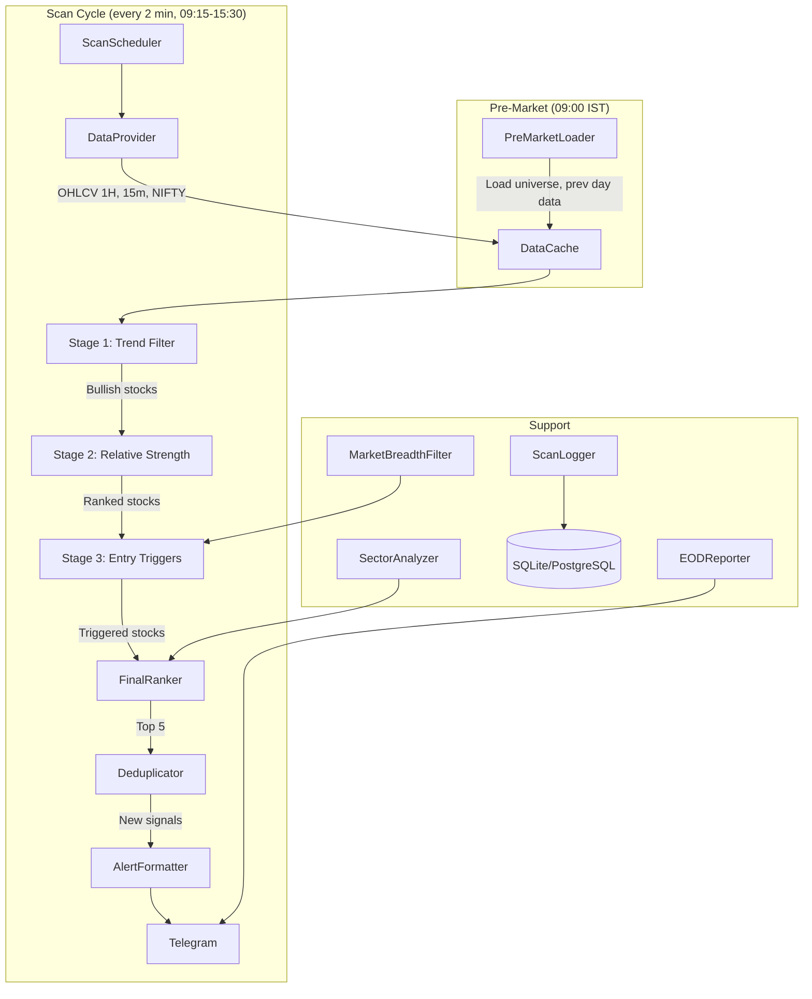

# Design Document: NSE Momentum Scanner

## Overview

This design describes a deterministic, rule-based momentum scanner that continuously evaluates ~500 NSE stocks during market hours through a three-stage filtering pipeline. The system identifies the top 5 strongest momentum stocks per scan cycle and delivers structured Telegram alerts with entry, stop loss, targets, and scoring metrics.

The scanner replaces the existing multi-strategy approach (Trend + VERC + MTF + Sentiment) with a focused, single-pipeline architecture optimized for early intraday trend detection. It reuses existing infrastructure (DataFetcher, AlertService, MarketScheduler, IndicatorEngine) while introducing new components for relative strength calculation, breakout detection, sector analysis, and market breadth filtering.

**Key Design Decisions:**
- **DataProvider abstraction**: The existing `DataFetcher` uses yfinance which has rate limits and ~15min delay. The new design abstracts data fetching behind a `DataProvider` interface to enable pluggable data sources (e.g., Yahoo Finance, broker APIs).
- **Multi-timeframe pipeline**: Stage 1 (1H trend filter) → Stage 2 (relative strength ranking) → Stage 3 (15m entry triggers). Each stage progressively narrows the universe.
- **2-minute scan cycles**: Much faster than the current 15-minute interval, requiring async batch fetching and efficient indicator caching.
- **Deterministic output**: Same OHLCV inputs always produce the same ranked output. No AI/LLM in the signal path.

## Architecture



**Data Flow:**
1. `ScanScheduler` triggers every 2 minutes during market hours
2. `DataProvider` fetches latest completed candles (1H + 15m) for all stocks + NIFTY
3. Stage 1 filters for 1H bullish trend structure (EMA alignment + slope)
4. Stage 2 ranks survivors by multi-window relative strength vs NIFTY
5. Stage 3 detects PULLBACK_CONTINUATION or COMPRESSION_BREAKOUT on 15m
6. `FinalRanker` applies weighted scoring formula, selects top 5
7. `Deduplicator` suppresses already-alerted stocks (same setup type, within cooldown)
8. `AlertFormatter` sends structured Telegram messages

## Components and Interfaces

### 1. DataProvider (Abstract Interface)

```python
from abc import ABC, abstractmethod
from typing import Dict, Optional
import pandas as pd

class DataProvider(ABC):
    """Abstract interface for broker API data fetching."""

    @abstractmethod
    async def fetch_ohlcv(self, symbol: str, timeframe: str, periods: int) -> Optional[pd.DataFrame]:
        """Fetch OHLCV data for a single symbol.
        
        Args:
            symbol: NSE stock symbol (e.g., 'RELIANCE')
            timeframe: '15m', '1h', or '1d'
            periods: Number of candles to fetch
        
        Returns:
            DataFrame with columns: open, high, low, close, volume, timestamp
        """
        pass

    @abstractmethod
    async def fetch_batch(self, symbols: list[str], timeframe: str, periods: int) -> Dict[str, pd.DataFrame]:
        """Fetch OHLCV data for multiple symbols concurrently."""
        pass

    @abstractmethod
    async def connect(self) -> bool:
        """Establish connection / authenticate with broker API."""
        pass

    @abstractmethod
    async def disconnect(self) -> None:
        """Clean up connection resources."""
        pass
```

Concrete implementations: `YahooFinanceProvider`, `MockDataProvider` (for testing). Additional broker-specific providers can be added by implementing the `DataProvider` interface.

### 2. ScanScheduler

```python
class ScanScheduler:
    """Manages scan cycle execution during market hours."""

    def __init__(self, config: ScannerConfig):
        self.scan_interval_seconds: int = config.scan_interval_seconds  # 120
        self.market_open: time = time(9, 15)
        self.market_close: time = time(15, 30)
        self.first_scan_time: time = time(9, 30)  # After first 15m candle completes
        self.pre_market_time: time = time(9, 0)

    async def run(self) -> None:
        """Main loop: pre-market load, then scan cycles every 2 min."""
        pass

    def is_market_day(self, date: date) -> bool:
        """Check weekday and NSE holiday calendar."""
        pass
```

### 3. Stage1TrendFilter

```python
class Stage1TrendFilter:
    """Filters stocks for bullish 1H trend structure."""

    def filter(self, stocks_1h_data: Dict[str, pd.DataFrame]) -> list[str]:
        """Return symbols passing all bullish conditions:
        - Price > EMA(200)
        - EMA(20) > EMA(50)
        - EMA(200) slope positive (diff over 5 periods / 5 > 0)
        """
        pass

    def calculate_trend_quality_score(self, df: pd.DataFrame) -> float:
        """Score 0-100 based on EMA alignment strength and slope magnitude."""
        pass
```

### 4. Stage2RelativeStrength

```python
class Stage2RelativeStrength:
    """Ranks stocks by relative strength vs NIFTY across multiple windows."""

    def __init__(self, weights: Dict[str, float]):
        # Default: intraday=0.5, 1day=0.3, 5day=0.2
        self.weights = weights

    def calculate_rs(self, stock_data: pd.DataFrame, nifty_data: pd.DataFrame, window: str) -> float:
        """Calculate RS = stock_pct_change - nifty_pct_change for given window."""
        pass

    def rank(self, symbols: list[str], stocks_data: Dict[str, pd.DataFrame], 
             nifty_data: pd.DataFrame) -> list[tuple[str, float]]:
        """Return symbols sorted by weighted composite RS score."""
        pass
```

### 5. Stage3EntryTrigger

```python
from enum import Enum

class SetupType(Enum):
    PULLBACK_CONTINUATION = "PULLBACK_CONTINUATION"
    COMPRESSION_BREAKOUT = "COMPRESSION_BREAKOUT"

class EntryTriggerResult:
    symbol: str
    setup_type: SetupType
    entry_price: float
    stop_loss: float
    target_1: float
    target_2: float
    relative_volume: float
    breakout_strength: float

class Stage3EntryTrigger:
    """Detects entry setups on 15m timeframe."""

    def detect(self, symbol: str, df_15m: pd.DataFrame, atr: float) -> Optional[EntryTriggerResult]:
        """Check for PULLBACK_CONTINUATION or COMPRESSION_BREAKOUT.
        Returns None if no trigger detected.
        Assigns exactly one setup type per stock per cycle.
        """
        pass

    def _check_pullback_continuation(self, df: pd.DataFrame) -> bool:
        """Price near EMA(20) + bullish candle + volume > 1.5x avg + breaks prev high."""
        pass

    def _check_compression_breakout(self, df: pd.DataFrame) -> bool:
        """3-6 tight candles + ATR contraction + volume expansion + strong breakout."""
        pass

    def _calculate_breakout_strength(self, df: pd.DataFrame) -> float:
        """Composite 0-100: body/range, close/high proximity, range expansion, volume, momentum."""
        pass
```

### 6. FinalRanker

```python
class FinalRanker:
    """Applies weighted scoring formula and selects top 5."""

    WEIGHTS = {
        'relative_volume': 0.35,
        'breakout_strength': 0.25,
        'trend_quality': 0.20,
        'distance_from_breakout': 0.10,
        'sector_strength': 0.10,
    }

    def rank(self, candidates: list[EntryTriggerResult], 
             trend_scores: Dict[str, float],
             sector_scores: Dict[str, float]) -> list[MomentumSignal]:
        """Normalize each component 0-100, apply weights, return top 5."""
        pass
```

### 7. MarketBreadthFilter

```python
class MarketBreadthFilter:
    """Suppresses long signals when market breadth is weak."""

    def __init__(self, config: ScannerConfig):
        self.decline_ratio_threshold: float = config.breadth_decline_ratio

    def is_market_healthy(self, nifty_500_data: Dict[str, pd.DataFrame], 
                          nifty_15m: pd.DataFrame) -> bool:
        """True if advancing > declining by threshold AND NIFTY > intraday EMA(20)."""
        pass
```

### 8. SectorAnalyzer

```python
class SectorAnalyzer:
    """Tracks sector index performance vs NIFTY."""

    SECTOR_INDICES = ['BANKNIFTY', 'NIFTY IT', 'NIFTY PHARMA', 'NIFTY METAL', 
                      'NIFTY FMCG', 'NIFTY AUTO', 'NIFTY REALTY', 'NIFTY ENERGY']

    def get_sector_scores(self, sector_data: Dict[str, pd.DataFrame], 
                          nifty_data: pd.DataFrame) -> Dict[str, float]:
        """Return sector outperformance scores vs NIFTY."""
        pass

    def get_stock_sector_boost(self, symbol: str, sector_scores: Dict[str, float]) -> float:
        """Return ranking boost for stock based on its sector's strength."""
        pass
```

### 9. Deduplicator

```python
class Deduplicator:
    """Manages alert throttling and deduplication."""

    def __init__(self, config: ScannerConfig):
        self.cooldown_seconds: int = config.cooldown_period_seconds
        self.max_daily_alerts: int = config.max_alerts_per_day  # default 20
        self._state: Dict[str, AlertState] = {}
        self._daily_count: int = 0

    def should_alert(self, signal: MomentumSignal) -> bool:
        """Check if signal should be sent (not duplicate, not in cooldown, under daily limit)."""
        pass

    def record_alert(self, signal: MomentumSignal) -> None:
        """Record that alert was sent."""
        pass

    def reset_daily(self) -> None:
        """Reset state at 09:15 IST each day."""
        pass

    def should_resend(self, signal: MomentumSignal) -> bool:
        """True if new breakout, new volume expansion, or new setup type."""
        pass
```

### 10. AlertFormatter

```python
class AlertFormatter:
    """Formats MomentumSignal into Telegram messages."""

    def format(self, signal: MomentumSignal) -> str:
        """Format signal as Markdown message with emoji indicators."""
        pass

    async def send(self, signal: MomentumSignal, alert_service: AlertService) -> bool:
        """Send formatted alert. Log failure and continue on error."""
        pass
```

### 11. ScanLogger

```python
class ScanLogger:
    """Logs every scan cycle to database."""

    def log_cycle(self, cycle: ScanCycleResult) -> None:
        """Store: indicators, scores, triggered/rejected setups, timestamps."""
        pass

    def generate_eod_report(self) -> EODReport:
        """Generate end-of-day summary at 15:30 IST."""
        pass
```

### 12. ConfigManager

```python
class ConfigManager:
    """Loads and validates scanner configuration."""

    def load(self, path: str = 'config/momentum_scanner.json') -> ScannerConfig:
        """Load config, validate ranges, apply defaults for missing values."""
        pass
```

## Data Models

```python
from dataclasses import dataclass, field
from datetime import datetime
from enum import Enum
from typing import Optional, Dict, List

class SetupType(Enum):
    PULLBACK_CONTINUATION = "PULLBACK_CONTINUATION"
    COMPRESSION_BREAKOUT = "COMPRESSION_BREAKOUT"

@dataclass
class MomentumSignal:
    """Core output of the scanner pipeline."""
    symbol: str
    setup_type: SetupType
    entry_price: float
    stop_loss: float
    target_1: float
    target_2: float
    relative_volume: float          # current_vol / SMA(vol, 30)
    relative_strength: float        # weighted composite RS score
    sector_strength: float          # sector outperformance vs NIFTY
    trend_quality_score: float      # 0-100, from Stage 1
    rank_score: float               # 0-100, final weighted composite
    breakout_strength: float        # 0-100, from Stage 3
    distance_from_breakout: float   # inverse score, closer = higher
    timeframe: str                  # "15m"
    timestamp: datetime             # IST
    risk_pct: float                 # (entry - stop_loss) / entry * 100
    trailing_stop: float            # EMA(20) on 15m

@dataclass
class ScannerConfig:
    """All configurable parameters."""
    # EMA periods
    ema_fast: int = 20
    ema_medium: int = 50
    ema_slow: int = 200
    ema_slope_lookback: int = 5

    # ATR
    atr_period: int = 14
    atr_sl_multiplier: float = 1.2

    # Volume
    volume_ma_period: int = 30
    volume_expansion_threshold: float = 1.5

    # Relative Strength weights
    rs_intraday_weight: float = 0.5
    rs_1day_weight: float = 0.3
    rs_5day_weight: float = 0.2

    # Ranking weights
    rank_relative_volume_weight: float = 0.35
    rank_breakout_strength_weight: float = 0.25
    rank_trend_quality_weight: float = 0.20
    rank_distance_weight: float = 0.10
    rank_sector_weight: float = 0.10

    # Scan timing
    scan_interval_seconds: int = 120
    market_open: str = "09:15"
    market_close: str = "15:30"
    pre_market_time: str = "09:00"

    # Alert throttling
    cooldown_period_seconds: int = 1800  # 30 min default
    max_alerts_per_day: int = 20

    # Filters
    min_liquidity_value: float = 10_000_000  # 1 Cr daily traded value
    min_daily_volume: int = 100_000
    max_gap_pct: float = 5.0
    min_breakout_strength: float = 40.0
    breadth_decline_ratio: float = 1.5

    # Sector boost
    sector_boost_pct: float = 5.0

    # Performance
    max_scan_duration_seconds: int = 60
    warn_scan_duration_seconds: int = 90
    batch_size: int = 50

@dataclass
class ScanCycleResult:
    """Result of one complete scan cycle."""
    timestamp: datetime
    duration_seconds: float
    stage1_passed: int
    stage2_ranked: int
    stage3_triggered: int
    signals_generated: List[MomentumSignal]
    signals_suppressed: int  # dedup/cooldown
    market_breadth_healthy: bool
    rejected_reasons: Dict[str, int]  # reason -> count

@dataclass
class AlertState:
    """Per-stock alert tracking state."""
    symbol: str
    last_alert_time: datetime
    last_setup_type: SetupType
    last_rank_score: float
    alert_count_today: int = 0

@dataclass
class EODReport:
    """End-of-day summary report."""
    date: datetime
    total_scans: int
    total_signals: int
    top_performers: List[MomentumSignal]
    setup_breakdown: Dict[str, int]  # setup_type -> count
    sector_breakdown: Dict[str, int]  # sector -> signal count
    avg_rank_score: float
    market_breadth_suppressed_count: int
```

## Correctness Properties

*A property is a characteristic or behavior that should hold true across all valid executions of a system — essentially, a formal statement about what the system should do. Properties serve as the bridge between human-readable specifications and machine-verifiable correctness guarantees.*

### Property 1: Completed Candle Selection

*For any* timestamp during market hours, the scanner SHALL select only the latest fully completed candle for calculations — never the in-progress candle. For a 15m timeframe at time T, the selected candle's end time must be ≤ T.

**Validates: Requirements 1.3, 13.3**

### Property 2: Graceful Skip on Missing Data

*For any* stock universe where a subset of stocks returns no data from the DataProvider, the scanner SHALL produce valid results for all remaining stocks without error. The output set size equals the number of stocks with valid data that pass all filters.

**Validates: Requirements 1.6**

### Property 3: Liquidity Filter Exclusion

*For any* stock where average daily traded value is below the configured threshold, OR average daily volume is below the configured minimum, OR the stock is a penny stock, suspended, or has an abnormal opening gap — the stock SHALL be excluded from the scan universe. No excluded stock shall appear in any stage output.

**Validates: Requirements 2.2, 2.3, 2.4**

### Property 4: Stage 1 Bullish Classification

*For any* 1H OHLCV data series, a stock is classified as bullish if and only if ALL three conditions hold simultaneously: (1) current price > EMA(200), (2) EMA(20) > EMA(50), (3) EMA(200) slope > 0. If any single condition is false, the stock is NOT bullish.

**Validates: Requirements 3.2**

### Property 5: Stage 1 Pipeline Exclusion

*For any* stock that fails the Stage 1 trend filter (not classified as bullish), that stock SHALL NOT appear in Stage 2 output, Stage 3 output, or the final ranking. The pipeline is strictly sequential.

**Validates: Requirements 3.3**

### Property 6: EMA Slope Formula Correctness

*For any* price series with at least 205 data points, the EMA(200) slope SHALL equal (EMA200_current - EMA200_5_periods_ago) / 5. This calculation is deterministic and produces the same result for the same input.

**Validates: Requirements 3.4**

### Property 7: Relative Strength Formula

*For any* stock price series and NIFTY price series over the same period, the Relative Strength value SHALL equal (stock_percentage_change - NIFTY_percentage_change) for that period. This holds independently for each of the three windows (intraday, 1-day, 5-day).

**Validates: Requirements 4.2**

### Property 8: Relative Strength Ranking Order

*For any* set of stocks with computed RS scores, the ranking SHALL be ordered by the weighted composite: (intraday_RS × w_intraday) + (1day_RS × w_1day) + (5day_RS × w_5day), where w_intraday > w_1day and w_intraday > w_5day. A stock with higher weighted composite always ranks above one with lower.

**Validates: Requirements 4.3**

### Property 9: Setup Type Mutual Exclusivity

*For any* stock in a single Scan_Cycle, the scanner SHALL assign at most one Setup_Type. A stock cannot simultaneously be classified as both PULLBACK_CONTINUATION and COMPRESSION_BREAKOUT in the same cycle.

**Validates: Requirements 5.4**

### Property 10: No Trigger Means Exclusion

*For any* stock where neither PULLBACK_CONTINUATION nor COMPRESSION_BREAKOUT conditions are met on the 15m timeframe, that stock SHALL NOT appear in the final ranking output.

**Validates: Requirements 5.5**

### Property 11: Relative Volume Formula

*For any* volume series of length ≥ 30, the Relative_Volume SHALL equal current_candle_volume / SMA(volume, 30). This is a pure arithmetic property.

**Validates: Requirements 6.1**

### Property 12: Volume Expansion Classification

*For any* computed Relative_Volume value, the stock is classified as having volume expansion if and only if Relative_Volume ≥ 1.5. Values below 1.5 are NOT classified as expansion.

**Validates: Requirements 6.2**

### Property 13: Higher Relative Volume Ranks Higher

*For any* two stocks that are identical in all ranking components except Relative_Volume, the stock with higher Relative_Volume SHALL have a higher final rank score.

**Validates: Requirements 6.3**

### Property 14: Breakout Strength Bounded [0, 100]

*For any* input candle data (any combination of OHLCV values), the computed Breakout_Strength SHALL always be in the range [0, 100] inclusive. No input can produce a value outside this range.

**Validates: Requirements 7.1, 7.2**

### Property 15: Below-Threshold Breakout Exclusion

*For any* stock where Breakout_Strength is below the configured minimum threshold, that stock SHALL NOT appear in the final ranking output.

**Validates: Requirements 7.3**

### Property 16: Sector Boost Application

*For any* stock belonging to a sector that is outperforming NIFTY, the stock's final rank score SHALL be higher than it would be without the sector boost (all else equal). The boost is additive and configurable.

**Validates: Requirements 8.3**

### Property 17: Market Breadth Suppression

*For any* market state where declining stocks exceed advancing stocks by the configured ratio AND NIFTY is below its intraday EMA(20), the scanner SHALL produce zero new long signals for that Scan_Cycle.

**Validates: Requirements 9.3**

### Property 18: Trade Levels Calculation

*For any* triggered stock with entry price E, candle low L, and ATR value A: (1) Stop Loss = min(L, E - 1.2 × A), (2) Risk = E - SL, (3) Target 1 = E + Risk, (4) Target 2 = E + 2 × Risk. These formulas are deterministic.

**Validates: Requirements 10.1, 10.2, 10.3, 10.4**

### Property 19: Minimum Risk-Reward Ratio

*For any* generated MomentumSignal, the risk-reward ratio (Target_1 - Entry) / (Entry - Stop_Loss) SHALL be ≥ 2.0. Signals that would violate this constraint are not emitted.

**Validates: Requirements 10.6**

### Property 20: Final Ranking Formula

*For any* set of normalized component scores (each in [0, 100]), the final rank score SHALL equal: 0.35 × RelativeVolume + 0.25 × BreakoutStrength + 0.20 × TrendQuality + 0.10 × DistanceFromBreakout + 0.10 × SectorStrength. The result is in [0, 100].

**Validates: Requirements 11.1, 11.2**

### Property 21: Distance Inverse Scoring

*For any* two stocks where one is closer to its breakout level than the other, the closer stock SHALL receive a higher Distance_From_Breakout score. Distance and score have an inverse relationship.

**Validates: Requirements 11.3**

### Property 22: Top 5 Selection

*For any* set of N qualifying stocks (N ≥ 0), the output SHALL contain min(N, 5) stocks, and they SHALL be the highest-ranked by final score. No stock outside the top min(N, 5) appears in output.

**Validates: Requirements 11.4, 11.5**

### Property 23: Alert Contains All Required Fields

*For any* MomentumSignal, the formatted Telegram message SHALL contain: symbol, setup type, entry price, stop loss, risk percentage, target 1, target 2, relative volume, relative strength, sector strength, trend quality score, rank score, timeframe, and IST timestamp.

**Validates: Requirements 12.1**

### Property 24: Market Hours Enforcement

*For any* timestamp that is outside 09:15–15:30 IST, OR on a weekend (Saturday/Sunday), OR on an NSE market holiday, the scanner SHALL NOT execute a Scan_Cycle.

**Validates: Requirements 13.1, 13.6**

### Property 25: Deduplication Suppression

*For any* stock that has already been alerted with the same Setup_Type during the current trading day AND is within the configured Cooldown_Period, a duplicate alert SHALL be suppressed.

**Validates: Requirements 14.2, 14.4**

### Property 26: Resend on Changed Conditions

*For any* previously alerted stock, a new alert SHALL be sent if and only if: a new breakout occurs, OR a new volume expansion event is detected, OR a different Setup_Type forms. Otherwise the alert is suppressed.

**Validates: Requirements 14.3**

### Property 27: Daily Alert Limit

*For any* trading day, the total number of unique stock alerts sent SHALL NOT exceed the configured maximum (default: 20). Once the limit is reached, no further alerts are sent regardless of signal quality.

**Validates: Requirements 14.6**

### Property 28: Determinism

*For any* identical set of OHLCV inputs (same stock data, same NIFTY data, same timestamps), the scanner SHALL produce identical output (same signals, same scores, same ranking) regardless of when or how many times it is executed.

**Validates: Requirements 18.1, 18.3**

## Error Handling

| Error Scenario | Handling Strategy | Recovery |
|---|---|---|
| DataProvider returns no data for a stock | Skip stock, log at DEBUG level, continue with remaining stocks | Automatic — next cycle retries |
| DataProvider connection failure | Log ERROR, retry with exponential backoff (1s, 2s, 4s), skip cycle if all retries fail | Automatic — next cycle retries |
| DataProvider returns partial data (< min candles) | Skip stock for current cycle, log at DEBUG | Automatic — accumulates data over time |
| Volume average is zero/unavailable | Exclude stock from current cycle (avoid division by zero) | Automatic |
| Configuration file missing/unreadable | Start with hardcoded defaults, log WARNING | Manual — fix config file |
| Configuration value out of range | Use default for that parameter, log WARNING with parameter name and value | Manual — fix config |
| AlertService Telegram send failure | Log ERROR with message details, continue sending remaining alerts, no retry | Automatic — next alert attempt |
| Scan cycle exceeds 60s | Log WARNING with bottleneck phase (fetch/calculate/rank/alert) | Automatic — investigate performance |
| Scan cycle exceeds 90s | Log ERROR, complete current cycle, investigate | Manual — optimize or reduce universe |
| Database write failure (scan logs) | Log ERROR, continue scanning (logging is non-critical path) | Manual — fix DB connection |
| Pre-market data load failure | Log ERROR, attempt to start with stale/cached data, retry at next interval | Automatic |
| All stocks filtered out (no Stage 1 survivors) | Log INFO "No bullish stocks found", produce empty result, no alert | Automatic |
| Holiday calendar outdated | Scanner runs but market returns no data, effectively a no-op | Manual — update calendar |

**Design Principle:** The scanner prioritizes availability over completeness. A partial scan (fewer stocks) is better than no scan. Non-critical failures (logging, analytics) never block the signal pipeline.

## Testing Strategy

### Unit Tests (Example-Based)

Unit tests cover specific scenarios, edge cases, and integration points:

- **DataProvider mock tests**: Verify correct API calls, error handling, retry logic
- **Configuration loading**: Missing file, invalid values, partial config
- **Alert formatting**: Verify Markdown structure, emoji presence, all fields included
- **Scheduling**: Pre-market timing, first scan at 09:30, holiday skipping
- **EOD report generation**: Correct aggregation of daily metrics
- **Database logging**: Verify scan cycle results are persisted correctly

### Property-Based Tests

Property-based tests verify universal correctness properties using the `hypothesis` library (Python). Each property test runs a minimum of 100 iterations with randomly generated inputs.

**Library:** `hypothesis` (Python PBT framework)
**Minimum iterations:** 100 per property
**Tag format:** `Feature: nse-momentum-scanner, Property {number}: {property_text}`

**Properties to implement as PBT:**

1. **Property 4** — Stage 1 classification (generate random OHLCV → verify classification matches conditions)
2. **Property 6** — EMA slope formula (generate random price series → verify formula)
3. **Property 7** — RS formula (generate random stock/NIFTY changes → verify subtraction)
4. **Property 8** — RS ranking order (generate random RS scores → verify ordering)
5. **Property 9** — Setup type mutual exclusivity (generate random 15m data → verify at most one type)
6. **Property 11** — Relative volume formula (generate random volume series → verify division)
7. **Property 12** — Volume expansion threshold (generate random RV values → verify classification)
8. **Property 13** — Higher RV ranks higher (generate two stocks differing only in RV → verify order)
9. **Property 14** — Breakout strength bounded (generate random candle data → verify [0, 100])
10. **Property 17** — Market breadth suppression (generate weak market state → verify zero signals)
11. **Property 18** — Trade levels calculation (generate random entry/ATR/low → verify formulas)
12. **Property 19** — Minimum RR ratio (generate random signals → verify RR ≥ 2)
13. **Property 20** — Final ranking formula (generate random components → verify weighted sum)
14. **Property 22** — Top 5 selection (generate random ranked lists → verify top 5 selected)
15. **Property 25** — Deduplication (generate alert sequences → verify suppression)
16. **Property 27** — Daily alert limit (generate alert sequences → verify cap)
17. **Property 28** — Determinism (generate random inputs → run twice → verify identical output)

### Integration Tests

Integration tests verify end-to-end behavior with real or mocked broker APIs:

- Full pipeline run with mock DataProvider returning realistic NSE data
- Telegram alert delivery (mock HTTP)
- Database persistence of scan logs
- Pre-market data loading sequence
- Multi-cycle deduplication across a simulated trading day

### Performance Tests

- Scan cycle duration with 500 stocks (target: < 60s)
- Async batch fetching throughput
- Memory usage under sustained operation (6+ hours)

